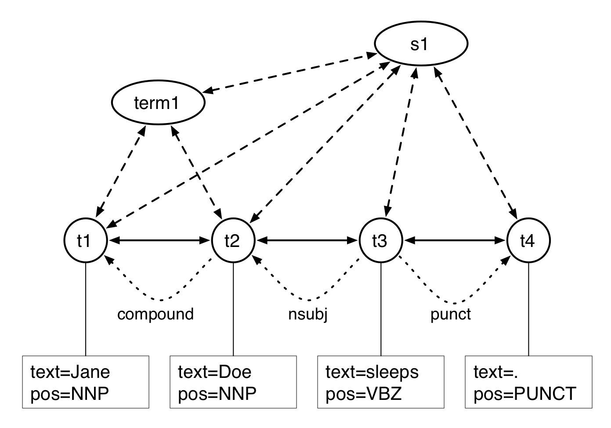

# Technology Finder -  Code Design

This design is based on the code initially developed for the FUSE project, but simplified as much as possible by (1) removing most of the housekeeping code, (2) simplifying a couple of overly complex components and (3) using Python third-party modules instead of interacting with Java modules for tagging and classifying. This design has been partially implemented and it appears that the size of the code will be reduced by a factor 5. The technology finder consists of four parts:

1. Data handling
2. Feature extraction
3. Classification
4. Maturity scoring

This document does not include notes on extracting states and further technology characterization (beyond maturity scores).


## 1. Summary


- Data handling
  - Taking a text document and transforming it into a unified format
  - Document structure: recognizing sections and headers
- Feature extraction
  - Basic NLP processing
    - Tokenization, sentence splitting, part-of-speech tagging
    - Dependency parsing and noun chunks extraction
  - Term extraction:
    - Start with nounchunks as proposed by the basic NLP processing
    - Extract tag signature from the chunk (for example "DET JJ NP NP")
    - Run a simple pattern over the tag signature and restrict the term to the matching part
  - Feature extraction for each candidate technical term
    - Extract features using the results from basic NLP processing
    - Extract classic feature vectors as well as word embeddings
- Classification - technologies
  - Create seeds by compiling lists of technology terms and lists of terms that are not technologies
    - Inherit existing lists fom the FUSE code
    - Additional term-level annotation candidate terms from WIkipedia data
    - Technologies as mentioned in the Wikipedia article titles
  - Create positive and negative examples of each term by collecting and typing feature vectors 
  - Use a logic regression algorith for the actual classification
- Classification - main technology
  - To extract the main technology in the text
  - Uses same vectors as before
  - Training data is created by manual annotation over technologies in documents
  - Annotation is limited to some section of the document
  - Technologies are annotated as "main", "component", "related" or "attribute"
  - Use logic regression.
- Maturity Score
  - Score between 0 and 1 that indicates maturity level of a technology
  - Based on textual evidence on whether a technology was used or referred to
  - Evidence for use is collected from the feature vectors and quantified as a weighted count
  - Scores are compiled indexed by time.


## 2. Data Handling

The data are handed in as a LIF file or as a text file without any markup. The former is a JSON-LD format used for the LAPPS Grid that puts the text data in a read-only text field and that has all annotations stored in views (also known as annotation layers) that are separate from the text data. For now, we assume the input is plain text so loading a file or string does not involve any parsing of a JSON-LD file.

No matter what the input format is, the file is loaded into a LIF object with one field for the text and another for a list of annotation layers (which would initially be empty for a text file). For example, an input file with

```
A thermometer is a device that measures temperature or a temperature gradient.
```

will be turned into the following LIF object

```json
{
    "text": {
        "@value": "A thermometer is a device that measures temperature or a temperature gradient."
    },
    "views": []
}
```

In Python code we have a method that takes a document and turns it into a LIF object:

```python
1.  lif = create_Lif("data/thermometer.txt")
```

The object created is represented as a JSON structure in the representation above, but in the implementation it will be a data structure appropriate for the language. For example, in Python it will most likely be a user-defined class named LIF whereas in Mathematica we may use a DataSet.

### 2.1. Document structure

Document structure we skip for now because in the first stage of the project we focus only on files from Wikipedia where the name of the file reflects the title of the page and the body contains all the text. But with the trivial example above, we would get

```json
{
    "text": {
        "@value": "A thermometer is a device that measures temperature or a temperature gradient."
    },
    "views": [
        {
            "id": "document-structure",
            "annotions": [
                {
                    "@type": "Paragraph",
                    "id": "p1",
                    "begin": 0,
                    "end": 78
                }
            ]
        }
    ]
}
```

The identifier can be any string, but usually is made to be somewhat descriptive. Note that the above is a somewhat simplified version of LIF because in LIF a view is typically associated with some metadata that indicates what kind of annotations are in the view.


## 3. Feature Extraction

Three kinds of annotations are created during feature extraction:

1. Tokens, sentence boundaries, art of speech tags and dependencies
2. Cancidate terms
3. Feature vectors

These annotations are all stored into views.


### 3.1. Tokens, sentences, parts of speech and dependencies

Document structure we skip for now because in the first stage of the project we focus only on files from Wikipedia where the name of the file reflects the title of the page and the body contains all the text. But with the trivial example above, we would get

```json
{
    "text": {
        "@value": "A thermometer is a device that measures temperature or a temperature gradient."
    },
    "views": [
        {
            "id": "document-structure",
            "annotions": [
                {
                    "@type": "Paragraph",
                    "id": "p1",
                    "begin": 0,
                    "end": 78
                }
            ]
        }
    ]
}
```

The identifier can be any string, but usually is made to be somewhat descriptive. Note that the above is a somewhat simplified version of LIF because in LIF a view is typically associated with some metadata that indicates what kind of annotations are in the view.


### 3.2. Tokens, sentences, parts of speech and dependencies

The next information to be extracted are the individual tokens, sentence boundaries, parts of speech of tokens and dependencies between tokens. Most features are directly derived from this basic linguistic information. It is not determined yet what part-of-speech and dependency set to use. Due to differences in integrating POS taggers and dependency parsers in Python and Mathematica we may need to work with two sets of parts-of-speech and dependencies.

```python
1.  text = lif.text.value
2.  pos_view = create_view("pos")
3.  for annotation in tag_text(text):
4.      pos_view.annotations.append(annotation)
5.  lif.views.append(pos_view)
```

For the code above, we assume that the LIF object we created with load_text() has a text field which itself has a value field. The create_view() method in line 2 creates an object with the following structure.

```json
{
    "id": "pos",
    "annotations": []
}
```

Again, in Python this would be a user-defined class, probably named View or something like that. The tag_text() method in line 3 takes the text string and creates annotations of two types: tokens and sentences, that is, it takes care of part of speech tagging as well as of tokenization and sentence splitting. The annotations all have the same format and include an annotation type, an identifier, a starting character offset, an ending character offset and a feature dictionary that for a part of speech is just the part of speech and maybe the word itself added for readability. In line 4 the new annotations are added to the view and in line 5 this new view is appended to the list-valued views field on the LIF object.

```json
{
    "@type": "Token",
    "id": "t1",
    "start": 0,
    "end": 1,
    "features": { "word": "A", "pos": "DT"}
}
```

A sentence annotation looks very similar, but has no need for features:

```json
{
    "@type": "Sentence",
    "id": "s1",
    "start": 0,
    "end": 78
}
```

It is the responsibility of the tag_text() function to return a list of objects of this kind, how it does that depends on the embedded tagger. The LIF object after this would look as follows (just including the first two tokens).

```json
{
    "text": {
        "@value": "A thermometer is a device that measures temperature or a temperature gradient."
    },
    "views": [
        {
            "id": "pos",
            "annotations": [
                {
                    "@type": "Sentence", "id": "s1", "start": 0, "end": 78
                },
                {
                    "@type": "Token", "id": "t1", "begin": 0, "end": 1,
                    "features": { "word": "A", "pos": "DT" }
                },
                {
                    "@type": "Token", "id": "t2", "begin": 2, "end": 13,
                    "features": { "word": "thermometer", "pos": "NN" }
                }
            ]
        }
    ]
}
```

The dependencies are added in a similar way:

```python
1.  text = lif.text.value
2.  tokens = lif.get_view("pos")
3.  dep_view = create_view("dep")
4.  for dep in dependency_parse_text(text, tokens):
5.      dep_view.annotations.append(dep)
6.  lif.views.append(dep_view)
```

We assume here that the dependencies are created from the text and its tokenization. Therefore in lines 1 and 2 the text and the tokens (with their parts of speech) are extracted. The get_view() method in line 2 selects the view with the identifier specified. The dependency_parse_text() method in line 4 is responsible for taking the text and token annotations and creating dependency objects in the same format as for the tokens and their parts of speech:

```json
{
    "@type": "Dependency",
    "id": "dep1",
    "features": {
        "governor": "pos:t2",
        "dependent": "pos:t1",
        "label": "det" }
}
```

Since a dependency is a relation it is not anchored in character offsets, instead it refers to the two objects that it is linking, using the identifier of the view as a prefix, separated from the annotation identifier by a colon.

After this, the (partial) LIF structure is as follows.

```json
{
    "text": {
        "@value": "A thermometer is a device that measures temperature or a temperature gradient."
    },
    "views": [
        {
            "id": "pos",
            "annotations": [
                {
                    "@type": "Sentence", "id": "s1", "start": 0, "end": 78
                },
                {
                    "@type": "Token", "id": "t1", "begin": 0, "end": 1,
                    "features": { "word": "A", "pos": "DT" }
                },
                {
                    "@type": "Token", "id": "t2", "begin": 2, "end": 13,
                    "features": { "word": "thermometer", "pos": "NN" }
                }
            ]
        },
        {
            "id": "dep",
            "annotations": [
                {
                    "@type": "Dependency", "id": "dep1",
                    "features": { "governor": "pos:t2", "dependent": "pos:t1", "label": "det" }
                }
            ]
        }
    ]
}
```

It is not necessarily the case that we first run one component that creates tokens and pos tags followed by a component that adds dependencies. We might have one component that combines both steps or even have more than two components. It all depends on what NLP modules we have available. For example, we could run all NLP processing using a spaCy model and then export data from the result of spaCy processing (the following assumes we have installed and imported spaCy and that we have downloaded the `en_core_web_sm` model):

```python
1.  nlp = spacy.load("en_core_web_sm")
2.  doc = nlp(lif.text.value)
3.  pos_view = create_view("pos")
4.  dep_view = create_view("dep")
5.  for annotation in get_sentence_and_token_annotations(doc):
6.      pos_view.annotations.append(annotation)
7.  for dep in get_dependency_annotations(doc):
8.      dep_view.annotations.append(dep)
9.  lif.views.extend([pos_view, dep_view])
```

It depends on the structure of the `doc` object how the methods in lines 5 and 7 are written.


### 3.3. Feature vectors

Feature extraction has two steps:

1. Identifying candidate terms
2. Feature extraction for each candidate term


#### 3.3.1. Identifying candidate terms

Feature vectors are extracted for all candidate technology terms. Candidate technology terms are extracted using a pattern over parts of speech (here using the Penn tag set, depending on the tagger used these patterns may change).

```
(NN | NNP | NNS | NNPS | POS | JJ | JJR | JJS | FW) NN* (NN | NNP | NNS | NNPS)
```

That is, the first token is one of a long list including nominals, possessives, adjectives and foreign words and the last token is a nominal. In-between is an arbitrary number of nouns. This pattern only includes multi-word terms, it may be changed to include one-word terms by making the first component optional:

```
(NN | NNP | NNS | NNPS | POS | JJ | JJR | JJS | FW)? NN* (NN | NNP | NNS | NNPS)
```

The full pattern has exceptions listed for the initial tokens and instead of NN or JJ we have something like the following.

```
[NN, [fig figure]],
[JJ, [en_jj_vb_noise]]
```

The embedded list contains a list of exceptions or a file with exceptions. The first line would match an NN as long as the word is not ‘fig’ or ‘figure’. The second line matches an adjective, but uses stop list with a few hundred adjectives.

The main challenge for the code that selects candidate terms is to write a pattern matcher that allows for the exceptions. This matcher is used by the extract_candidate_terms() method below.

```python
1.  text = lif.text.value
2.  tokens = lif.get_view("pos")
3.  terms_view = create_view("terms")
4.  for term in extract_candidate_terms(text, tokens):
5.      terms.annotations.append(term)
6.  lif.views.append(terms_view)
```

The terms created look as follows:

```json
{
    "@type": "Term",
    "id": "term1",
    "start": 2,
    "end": 13,
    "features": {"word": "thermometer"}
}
```

Notice how similar the top-level code of term extraction is to the code for extracting dependencies. We now turn to some more specifics on the extract_candidate_terms() method. First note that we need some code to take the pattern and compile it, which is simply a way of going from the text represenation to a Python or Mathematic data structure.

```python
1.  def compile_pattern(pattern):
2.      # Take the pattern in text form and turn it into a Python data structure
3.      # Return the compiled pattern
```

To extract terms you take all sentences and for each sentence you apply the pattern to subsequences of the sentence by trying to find a match for the pattern at each position in the sentence.

```python
1.  def extract_candidate_terms(text, tokens):
2.      compiled_pattern = compile_pattern(pattern)
3.      terms = []
4.      for sentence in get_sentences(tokens):
5.          for start in range(0, len(sentences)):
6.              term, end = apply_fsa(compiled_pattern, sentence, start)
7.              if term is not None:
8.                  terms.append(create_term(term, start, end))
9.      return filter_terms(terms)
```

This returns a list of candidate terms in the format described about half a page above. We now look at the relevant parts of the code above.

- **get_sentences().** This is a method that for a given view with tokens and sentences returns a list of sentences where each sentence is a list of annotations of type token.

- **apply_fsa()**. This takes a compiled pattern, a sentence and a starting location in the sentence (a token offset) and returns a term and an ending location. If no term was found both term and end will be set to None. This can be implemented as an augmented Finite State Automaton. In a regular FSA the transition labels is a character that needs to match the next element of the put string. The augmentation is that the label is a structure and the next element of the input a token element.

- **filter_terms()**. The apply_fsa() procedure is applied to each position in the sentence and can therefore return overlapping terms, for example, it is very possible that in a string *clinical thermometer* we could get both *clinical thermometer* and *thermometer* as candiate terms (the latter when starting the procedure from the second position in the sequence). This method filters out terms that overlap with terms starting at an earlier position. We can dispense of this method if extract_candidate_terms() does not go through the sentence step by step, but skips to the end position of the candidate term if one was found.

As mentioned earlier, the result of this processing is an new view with term annotations.

**Alternative implementation**. An alternative to the above is to use noun chunks if your linguistic analysis provides them. This would give you candidates like *the thermometer* and terms that include one of the many adjectives that are part of the stoplist, but you could add some code that shortens the candidate terms under those conditions. Note that if you use the spaCy noun chunks for this you will miss out on some one-token proper names, for example, with *Sue sleeps* you do not get *Sue* as a noun chunk.


#### 3.3.2. Extracting features for candidate terms

The goal of this stage is to associate a set of features to each candidate term, for which the features dictionary on the annotation can be used. Here is an example with a very minimal set of features:

```json
{
    "@type": "Term",
    "id": "term1",
    "start": 2,
    "end": 13,
    "features": {
        "word": "thermometer",
    	"pos": "NN",
    	"next3_tags": "BE DT NN",
    	"next3_words": "is a device"}
}
```

For now we will work with a set of features inspired by the features used for the FUSE code, but in a feature word embeddings may be added.

The following features are the features that have been used in the FUSE implementation for classifying the candidate terms as technologies or non-technologies:

| feature      | description                                                         |
| ------------ | ------------------------------------------------------------------- |
| document_loc | the section in the document                                         |
| sentence_loc | the token offsets in the sentence                                   |
| section_loc  | the location in section                                             |
| prev_n3      | previous three nominals                                             |
| next_n3      | next three nominals                                                 |
| prev_n2      | previous two nominals                                               |
| next_n2      | next two nominals                                                   |
| next2_tags   | next two tags                                                       |
| first_word   | first word of the candidate term                                    |
| last_word    | last word of the candidate term                                     |
| plen         | length of the candidate term                                        |
| tag_list     | tag signature of the candidate term                                 |
| prev_V       | previous verb                                                       |
| prev_VNP     | previous verb with object: *[increase the speed] of the [computer]* |
| prev_Npr     | first noun_prep to the left of chunk, within 4 words                |
| prev_Jpr     | first adj_prep to the left of chunk, within 4 words                 |
| prev_J       | adjective immediately before the candidate term                     |

Changes will be made to this set of features. Some of the them are approximations of syntactic features. For example, prev_V is really intended to capture the dominating verb of a term but since we did not have dependency relations this was faked in a rather complicated way.

The top-level code for adding features can look as follows:

```python
1. def generate_features(lif):
2.     for term in lif.get_terms():
3.         add_features(term, lif)    
```

The get_terms() method simply takes the terms view from the lif object and returns al the terms in it. In Python this would probably be implemented as a method on the LIF class but it could also be implemented in non-object-oriented fashion (this is true for all methods in this design document).

Most complexity lies in the add_features() code which creates a graph from the LIF object and then traverses the graph from the term nodes for easy collection of features. Here is a schematic representation of the graph as currently implemented in the Python code:



There are three kinds of nodes: token nodes, term nodes and sentence nodes. The term nodes form a linked list in the graph (edges indicated by solid arrows). Token nodes are connected to the terms and sentences that they occur in (dashed arrows), similarly terms and sentences are connected to the tokens they contain, and terms are linked to the sentence they occur in and vice versa. Finally, dependency relations are expressed between the token nodes (dotted arrows). Each token node is associated with a feature structure with information like the part of speech that was derived during NLP analysis.


## 4. Classification

- Classification - technologies
  - Create seeds by compiling lists of technology terms and lists of terms that are not technologies
    - Inherit existing lists fom the FUSE code
    - Additional term-level annotation candidate terms from WIkipedia data
    - Technologies as mentioned in the Wikipedia article titles
  - Create positive and negative examples of each term by collecting and typing feature vectors
  - Use a logic regression algorith for the actual classification
- Classification - main technology
  - To extract the main technology in the text
  - Uses same vectors as before
  - Training data is created by manual annotation over technologies in documents
  - Annotation is limited to some section of the document
  - Technologies are annotated as "main", "component", "related" or "attribute"
  - Use logic regression.


## 5. Maturity Score

- Maturity Score
  - Score between 0 and 1 that indicates maturity level of a technology
  - Based on textual evidence on whether a technology was used or referred to
  - Evidence for use is collected from the feature vectors and quantified as a weighted count
  - Scores are compiled indexed by time.
